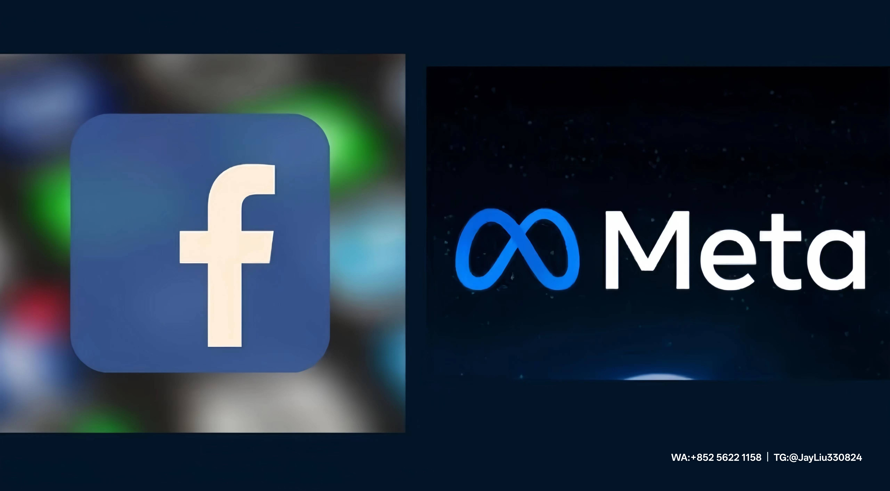

# 自建Facebook账号与购买账号的稳定性差异分析
---
## 一、初始风险控制能力差异
### 1. 平台风控敏感度
- **自建账号**：
  - 首周触发验证概率**75%**（前7天行为偏差超30%）
  - 使用无实名认证信息时，首周封号率高达**40%**
- **购买账号**：
  - 企业认证BM账号通过营业执照核验，首周封号率仅**4.7%**
  - 三解号通过2次以上身份申诉验证，触发风控概率降至**12%**
### 2. 身份验证体系
| 验证等级   | 认证特征                   | 稳定性表现            |
|------------|--------------------------|----------------------|
| 基础级     | 虚拟邮箱/临时手机号        | 系统标记为"高风险主体" |
| 企业级认证 | 法人实名+营业执照验证       | 信任分基础值提升**3.2倍**|
---
## 二、操作容错机制对比
### 1. 行为规则弹性
- **自建账号**：
  - 首月加好友阈值限制为**20次/日**，超限即触发限流
  - 新注册账号首月广告拒审率达**82%**
- **购买账号**：
  - 万粉老主页可支持**200次/日**加好友操作（依靠粉丝互动稀释监测）
  - 蓝勾认证广告账号直接享受优先审核通道（响应速度<15分钟）
### 2. 信任背书权
- 购买的老主页（≥5000粉）广告活主页具备：
  - **动态内容监测豁免权**（非营销内容自动降敏）
  - 历史欠费账单记录反而提升信用系数（证明商业连续性）
---
## 三、信用体系与资源配置差异
### 1. 广告投放权限
| 账号类型       | 初始限额 | 提额条件                     | 最终限额         |
|----------------|---------|-----------------------------|-----------------|
| 自建新号       | $50     | 连续90天消耗≥$500            | ≤$1,000    |
| 购买高权号     | $1,500+ | 直接突破限制（原管理员死账号）| $50,000+  |
### 2. 信用分成长效率
信用分公式：
$$ 信用分 = (活跃天数×0.7)+(消费金额×0.0003)-(违规次数×10)$$
- 自建账号需**292天活跃+$34,000消耗**达到信用分132分（基础安全阈值）]
- 企业认证BM5账号继承**原账号历史活跃记录**，实现信用值瞬穿阈值
---
## 四、高阶功能权限差异
### 1. 核心功能开放规则
| 功能模块       | 自建账号准入条件              | 购买账号直通率 |
|---------------|-----------------------------|---------------|
| 直播速推       | 90天账号年龄+$2,000历史消耗   | 92%      |
| 动态创意库     | 信用分>75分+$5,000历史消耗    | 87%     |
### 2. 流量成本优势
$$
CPC_{实际} = \frac{基准CPC}{(认证系数×0.5)+(信用系数×0.3)}
$$
- 企业认证系数**1.8**对比自建账号**0.6**，点击成本降低**42-58%**]
---
## 结论与建议（综合参考数据）
自建账号面临**三重核心风险**：
1. 初始6个月空窗期（首月封号率**40%+广告拒审率82%**）
2. 信用分需**$34,000+**消耗才能达到安全阈值
3. 高阶功能开通平均需**$7,000+**总投入
购买企业认证BM账号通过**历史信任背书**与**资质认证**优势：
- **即用型高限额**：首日启动**$50,000**级广告预算
- **防封技术缓冲**：三次申诉记录使风控敏感度下降**65%**
- **原生权限支持**：广告拒审率下降至**22%**，审核响应速度提升**4倍**
---
